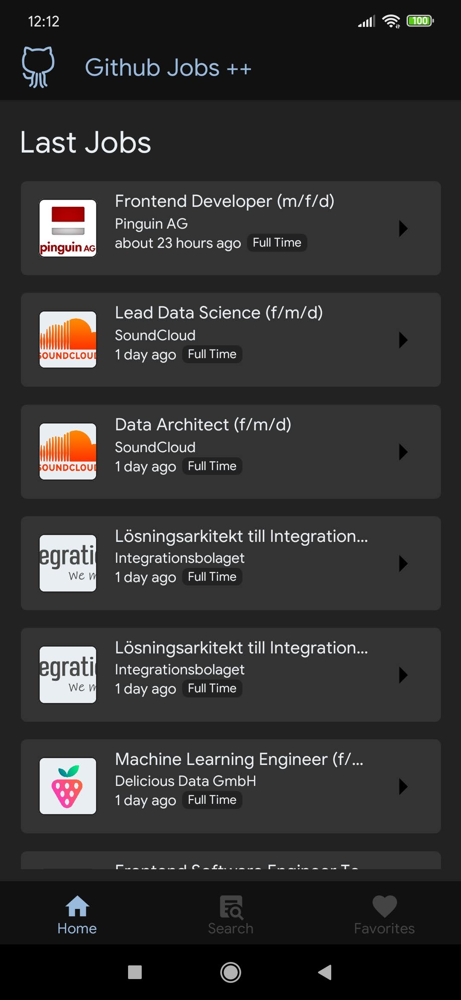
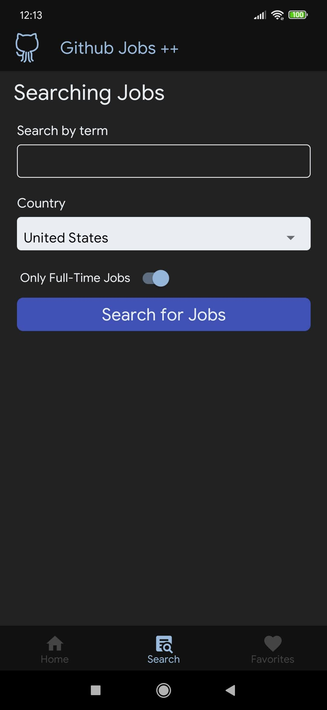
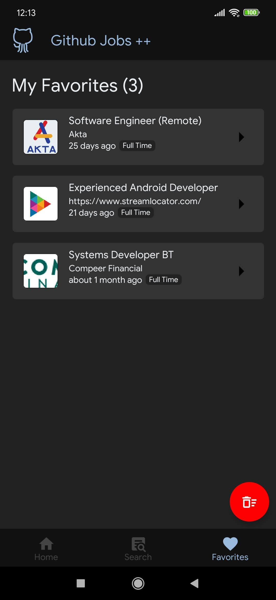
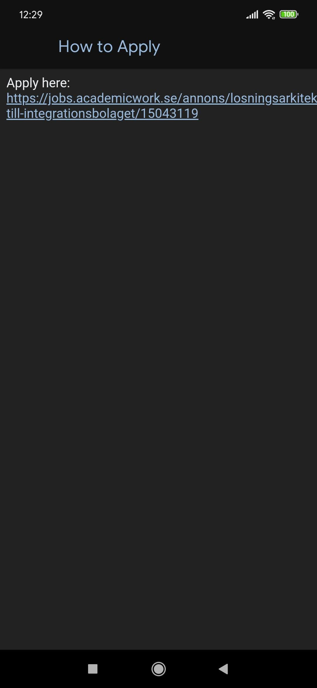

# Github Jobs ++

Find your first/next job directly from the `src`!
## About
This is a React Native application made for learning purposes, but It's functional and you can use it as your job hunt main tool. It uses the Github Jobs API to fetch the jobs.

## Tools used
* React Native
* Typescript

## Running

### You will need these tools as prerequisites:

* Node.js
* Npm/Yarn
* react-native-cli (or just use it with `npx`)
* Android device (physical or emulator)

### Clone
`git clone https://github.com/gughog/github-jobs-plus-plus-app.git`

### Install the dependencies

```bash
# NPM
npm install

# Yarn
yarn install
```

### Running

First, start the Metro server:
```bash
npm run start
```

Then, runs on your device:
```bash
npm run android
```

## Overview

<div style="text-align: center;">
  
  
  
  
  
  
</div>

## License
[MIT](https://choosealicense.com/licenses/mit/)

## Credits

- Icons made by <a href="http://www.freepik.com/" title="Freepik">Freepik</a> from <a href="https://www.flaticon.com/" title="Flaticon">www.flaticon.com</a></div>
